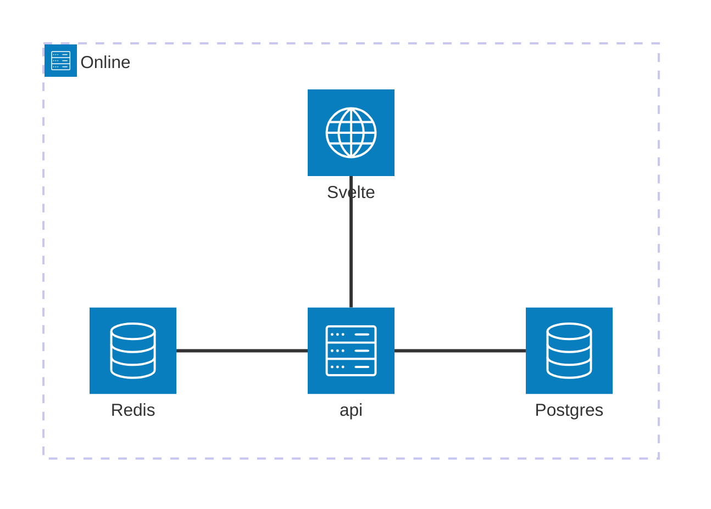

# Online

The public site to book and login as member.

## API (Backend)

```bash
# tool restore and update
dotnet tool restore
dotnet tool update --all

# List updates
dotnet list package --outdated
# Update packages
dotnet package update

# ef
dotnet ef migrations add InitTables --project src/online/online.csproj -o ./Data/Migrations
dotnet ef migrations remove --project src/online/online.csproj
```

### Secrets

```bash
dotnet user-secrets init --project api/src/online
dotnet user-secrets set "Authentication:Google:ClientId" "secret" --project api/src/online
dotnet user-secrets set "Authentication:Google:ClientSecret" "secret" --project api/src/online
dotnet user-secrets list --project api/src/online
```

## Client (Front End)

### Start

```bash
# cd client
pnpm dev
```
## Principles

- Simplicity
- Guests should be able to book
- Re-use same UI for members guests and staff where possible
- URLs should be deterministic.
- Mobile First
- Code first DB design

### Diagram



### Todo Phase 1

- [x] Register - Google oauth
- [ ] ~~View Account~~ - Profile Details
- [x] Log in - Google auth
- [ ] Roles and Policies
- [ ] View Time sheet
- [ ] Book slots - booking per day
- [ ] Cancel booking
- [ ] View other players in slot
- [ ] Book a guest
- [ ] View Bookings
- [ ] Book Extras
- [ ] Extra Equipment Agreement
- [ ] Notification Email/SMS
- [ ] Payments - Account per club or 1 account managed by Aviate - Create accounts. Link accounts to club or multiple clubs.
