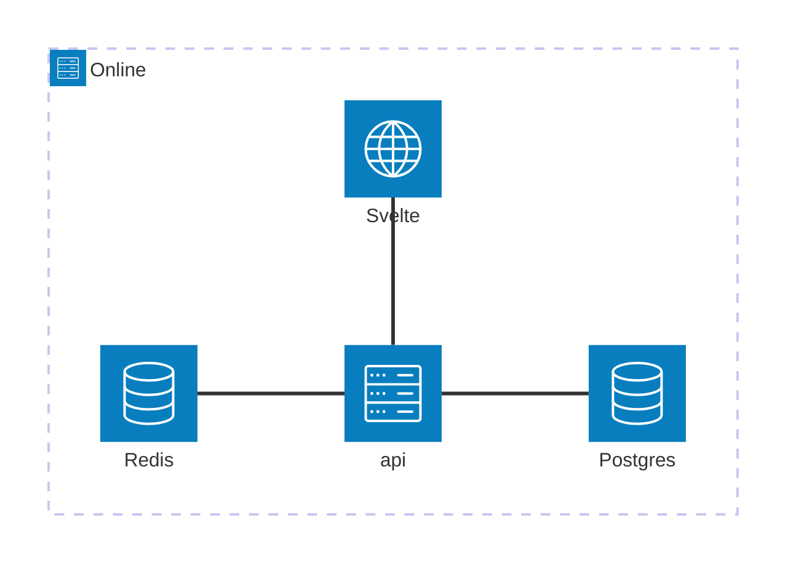

# Online

The public site to book and login as member.

## API (Backend)

```bash
# tool restore and update
dotnet tool restore
dotnet tool update --all

# List updates
dotnet list package --outdated
# Update packages
dotnet package update

# ef
dotnet ef migrations add InitTables --project src/online/online.csproj -c AppDbContext -o ./Data/Migrations
dotnet ef migrations remove --project src/online/online.csproj

# remove
dotnet ef migrations remove --project src/online/online.csproj

# list dbContexts
dotnet ef dbcontext list --project src/online/online.csproj --startup-project src/online/online.csproj

# TickerQ
dotnet ef migrations add TickerQInit --project src/online/online.csproj -c TickerQDbContext -o ./Data/TickerQMigrations

# squash migrations
dotnet steward squash api/src/online/Data/Migrations
```

### Secrets

```bash
dotnet user-secrets init --project api/src/online
dotnet user-secrets set "Authentication:Google:ClientId" "secret" --project api/src/online
dotnet user-secrets set "Authentication:Google:ClientSecret" "secret" --project api/src/online
dotnet user-secrets list --project api/src/online
```

## Client (Front End)

### Start

```bash
# cd client
pnpm dev
```
## Principles

- Simplicity
- Guests should be able to book
- Re-use same UI for members guests and staff where possible
- URLs should be deterministic.
- Mobile First
- Code first DB design

### Diagram


```mermaid
architecture-beta
    group online(server)[Online]

    service db(database)[Postgres] in online
    service redis(database)[Redis] in online
    service api(server)[api] in online
    service svelte(internet)[Svelte] in online

    svelte:B -- T:api
    db:L -- R:api
    redis:R -- L:api
```

### Todo Phase 1

- [x] Register - Google oauth
- [ ] ~~View Account~~ - Profile Details
- [x] Log in - Google auth
- [ ] Roles and Policies
- [ ] View Time sheet
- [ ] Book slots - booking per day
- [ ] Cancel booking
- [ ] View other players in slot
- [ ] Book a guest
- [ ] View Bookings
- [ ] Book Extras
- [ ] Extra Equipment Agreement
- [ ] Notification Email/SMS
- [ ] Payments - Account per club or 1 account managed by Aviate - Create accounts. Link accounts to club or multiple clubs.

### Temp Planning

- [x] Add Players + and - button with client validation
  - [ ] Validate on book button before showing next page
  - [ ] On booking page you should be able to reload and still continue where you left off with time remaining if applicable.
  - [ ] You decide before how many players you are booking for. This will get validated. Start over if you want to change it.
- [ ] my Bookings


### Temp Booking validation types?

Types of validation checks
- Pre Check (This check happens before a booking is created) - Check if slots are available. Only allow if you lower price if you are part of it.
- Check (This check happens before booking status can become confirmed)

- Logged in
- Has Contract (Needs params, can be comma seperated list?)
- Has Handicap

- Other option can book for guests. All should be members?

Payments can you allow no payment and accept payment on arrival?

Payment Options?
- Pay before
- Pay on arrival
- Deposit %


### Auth Plan

Sync user accounts with identity
Call /users endpoint in identity and sync
Add column lastSync to users table.
Only update if lastUpdate is older than 24 hours.

### TODO

- [x] open-id-ts client setup. 
- [x] Bearer instead of cookie
- [X] Keycloak client auth backend services
- [ ] Add user sync with identity service
- [ ] Session management
- [ ] Verify email address
- [ ] Verify phone number
- [ ] Update profile
